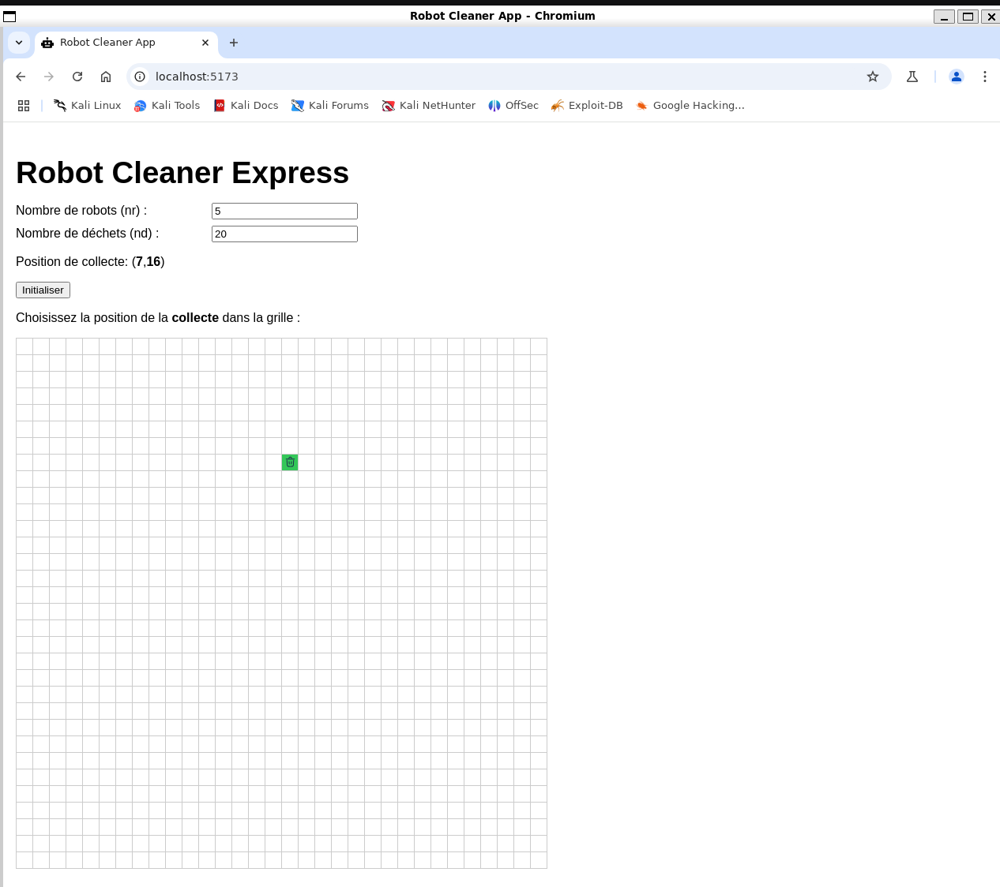
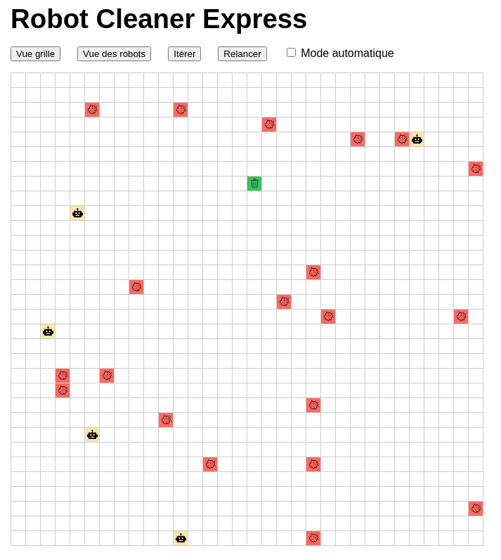
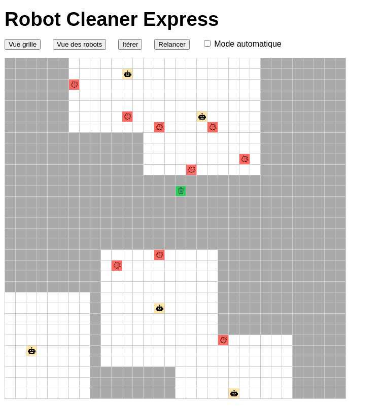
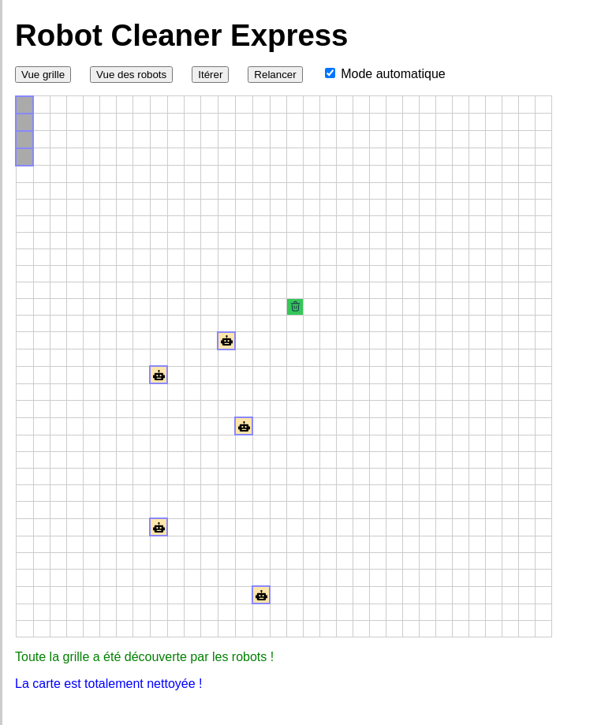
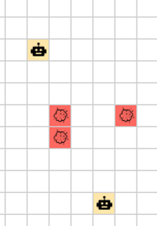
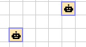

# Robot Clean Express
Robot clean express simulation. 

Réalisé par Alexandre Bodin sur 3 jours dans le cadre d'un stage technique pour Eledone

# Pour lancer l'application
## backend
``` 
python3 -m venv venv
source venv/bin/activate
pip install django djangorestframework
pip install django-cors-headers 
cd robotclean
``` 
puis : 
 	``` 
./run.sh
 	``` 
## frontend
``` 
sudo apt install npm
cd robot-frontend
``` 
puis :
	``` 
./run.sh
	```

Le frontend de l'application est alors accessible par défaut sur http://localhost:5173/
(suivre les indications de VITE dans le terminal).

## Screen capture


Setup initial, paramétrage



Vue de la grille complete



Vue des robots : carte découverte 5 cases autour



Fin quand plus de déchet ni rien à découvrir

## Videos d'exemple de parties :

[Accéder au dossier des vidéos](./assets/videos)

# Creation du projet
Génération d'une base de fichiers à l'aide des commandes de django et vite
## backend
``` 
python3 -m venv venv
source venv/bin/activate
pip install django djangorestframework
``` 
### eviter des erreurs cross origin CORS

``` 
pip install django-cors-headers 
``` 
### create project
``` 
django-admin startproject robotclean
cd robotclean
``` 
### create app backend
``` 
python manage.py startapp robotbackend
``` 
### add app to project
``` 
	nano robotclean/settings.py
``` 
``` 
INSTALLED_APPS = [
    "corsheaders",
    "rest_framework",
    "robotbackend"
``` 
	
* create urls.py in project and robotbackend app
* create views.py in app robotbackend


## FRONT en react.js
``` 
sudo apt install npm
npm create vite@latest robot-frontend -- --template react-ts
cd robot-frontend
``` 

# Fonctionnement de l'algorithme
## Vision
On dispose de la grille initiale, mais les robots ont leur propre grille qui correspond aux zones découvertes à 5 case d'un robot existant.


Les robots ont la même grille partagée et gardent en mémoire les zones déjà connues


## Etats : Affectés / Disponibles
Les robots et les déchets sont par défaut "disponible" (ils n'ont pas de cadre autour).



Une fois "affectés" voir ci-dessous, ils sont encadrés par une bordure bleue autour de leurs icones.



## Affectation
La priorité est le ramassage des déchets, pour cela le programme va :

1) mettre à jour la carte connue des robots (concerver les cases déjà connues + les cases à 5 de distance de chaque robot)

2) dans la carte découverte uniquement, rechercher s'il existe des déchets non affectés 

3) Pour chaque déchet non affecté, recherche du robot <strong>non affecté</strong> le plus proche. Ceux ayant déjà une activité sont ignorés peu importe celle-ci

S'il existe un couple (déchet, robot) non affecté : le déchet et le robot sont marqués affectés et le robot a pour destination le déchet. Le déchet n'est plus disponible pour un autre robot

4) S'il reste des robots non affectés et des zones non découvertes, le robot est affecté à la case de la zone découverte la plus proche (cela devient sa destination). 

5) un robot affecté à un déchet et l'atteignant va retirer le déchet de la grille (chargé sur le robot) et prend pour destination la corbeille (il reste affecté jusqu'à la corbeille).

6) un robot avec un déchet en destination de la corbeille redevient disponible à son contact : s'il peut atteindre la case, il libère le déchet et est disponible

7) si plus aucune case à découvrir ni plus aucun déchet non affecté le robot reste définitivement sans affectation. Toutefois : voir "collisions" ci-après, il n'est pas "immobile" pour ne pas créer de mur de robots non affectés. Il se déplace aléatoirement dans une direction

## Déplacement
Chaque robot qui a une destination (et ne l'a pas atteinte) va se déplacer : 

Pour cela, il fait un 'pas' sur l'axe i ou j, mais pas les deux (pas de diagonale).

Il prend par défaut la direction dans laquelle il y a le plus de distance à faire sauf collision


## Collision
Un robot qui doit se déplacer sur une case ne peut y aller si elle est occupée par un autre robot : soit, car un autre vient de se déplacer vers cette case, soit si il ne la quite pas pour un autre. 

Si le robot avait "prévu" de déplacer sur l'axe i, il tente le déplacement sur l'axe j si possible (et inversement).

Si le robot est toujours coincé (case invalide, case encore occupée, ou sur un bord, etc) : il va aléatoirement se déplacer sur un autre axe même si cela ne le rapproche pas de la destination (éviter l'effet de 'mur' de robots immobiles). A la prochaine itération, il reprend sa route 

## Fin de partie
Les tours prennent fin si aucun déchet ne reste <strong>ET QU'AUCUNE</strong> case ne reste à découvrir, car il pourrait y avoir un déchet.
Des alertes sont affichées pour l'utilisateur indicant si les robots ont fini l'exploration et fini la partie. 


# Amélioration possibles
* ajout d'obstacles (ex : nouvelle case "arbre" qui sont des case interdites pour toute la partie)
* gestion d'un sessionID permettant des parties multijoueurs sur le serveur
* meilleure gestion des robots et des affectations (objets) permettant des affectations prioritaires ; A ce jour les grilles ne sont que des matrices avec un code sur la case
* algorithme d'évitement et de destination plus fin (pas en random)
* meilleure géstion des répartitions de missions aux robots (ex : un robot qui découvre une case en exploration et qui en est le plus proche pourrait s'y diriger directement)
* ...
